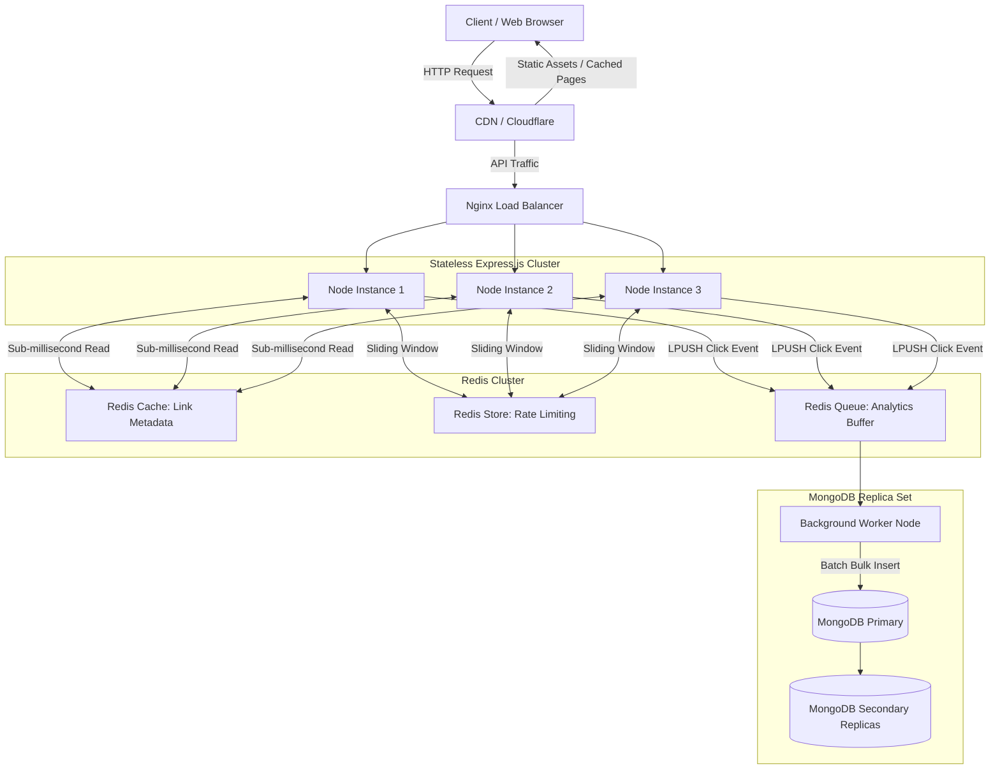

# Caching and Scalability Guide for ExpirableURLGenerator

This document provides a comprehensive technical breakdown of **Caching** and **Scalability** tailored specifically for the **ExpirableURLGenerator** codebase. It covers core concepts, pinpoints exact locations in this project for implementation, provides production-ready code patterns, and offers system design interview talking points.

---

## 📖 1. Core Concepts Explained

### ⚡ Caching
**Caching** is the technique of storing copies of frequently accessed or expensive data in a fast, temporary storage layer (such as in-memory RAM using Redis) so that future requests for that data can be served significantly faster than querying a persistent disk database (MongoDB).

#### Key Caching Strategies:
1. **Cache-Aside (Read-Aside)**:
   - *How it works*: The application checks the cache first. On a **cache hit**, data is returned immediately. On a **cache miss**, data is fetched from MongoDB, stored in Redis with a Time-To-Live (TTL), and returned.
   - *Best for*: URL shortener link resolution (`GET /api/links/:slug`).
2. **Write-Through / Cache Invalidation**:
   - *How it works*: When a URL is updated or deleted by its owner, the cache entry is explicitly evicted or updated in Redis to prevent stale data.
3. **Write-Behind (Write-Back) / Asynchronous Logging**:
   - *How it works*: Writes (e.g., click counts, analytics events) are written rapidly to Redis or a message queue and asynchronously flushed to MongoDB in batches.

---

### 📈 Scalability
**Scalability** is the capability of a system to handle growing amounts of traffic or data volume gracefully without degradation in performance.

#### Key Types of Scalability:
1. **Vertical Scaling (Scale-Up)**: Adding more CPU/RAM to a single server instance (limited by hardware ceilings and costs).
2. **Horizontal Scaling (Scale-Out)**: Adding more server instances (Node.js Express nodes) behind a Load Balancer (Nginx / AWS ALB).
3. **Stateless Application Architecture**: Ensuring Node.js application nodes store no session state in memory (using JWT for authentication and Redis for shared rate-limiting/cache).
4. **Database Scaling**:
   - **Indexing**: Accelerating query lookup time from $O(N)$ full table scan to $O(\log N)$ B-Tree lookup.
   - **Read Replicas**: Distributing read queries across MongoDB replica nodes.
   - **Sharding**: Partitioning link data across database shards based on a shard key (e.g., `slug` hash).

---

## 🗺️ 2. Where to Implement in ExpirableURLGenerator

Below is the architectural map of where caching and scalability components fit into this project:



### Codebase Audit: Current Bottlenecks & Targeted File Locations

| Component / Layer | Targeted File Path | Current Status | Scalability / Caching Target |
| :--- | :--- | :--- | :--- |
| **Link Resolution (Redirects)** | [linkController.js](file:///d:/ExpirableURLGenerator/backend/src/controllers/linkController.js#L194-L248) | Every redirect queries MongoDB `Link.findOne({ slug })` | Implement **Redis Read-Aside Cache** for sub-ms link lookups. |
| **Analytics Logging** | [linkController.js](file:///d:/ExpirableURLGenerator/backend/src/controllers/linkController.js#L237-L241) | Every click triggers synchronous `Analytics.create` & `link.save()` DB writes | Implement **Write-Behind Queueing** via Redis batch worker. |
| **Rate Limiting** | [rateLimiter.js](file:///d:/ExpirableURLGenerator/backend/src/middlewares/rateLimiter.js#L1-L30) | Configured with `rate-limit-redis` | Distribute across Express cluster instances. |
| **Database Indexing** | [Link.js](file:///d:/ExpirableURLGenerator/backend/src/models/Link.js)<br>[Analytics.js](file:///d:/ExpirableURLGenerator/backend/src/models/Analytics.js) | Basic schemas without compound indexes | Add compound indexes (`slug`, `ownerId + createdAt`, `linkId + timestamp`). |
| **Server Scaling** | `backend/src/app.js` | Single process listener | Enable PM2 cluster mode or containerized multi-node setup behind Nginx. |

---

## 🛠️ 3. How to Implement: Step-by-Step Technical Guide

### Step 1: Redis Caching Service (`backend/src/services/redisService.js`)

Create a dedicated Redis caching utility module in `backend/src/services/redisService.js`:

```javascript
// backend/src/services/redisService.js
import Redis from "ioredis";

const redis = new Redis(process.env.REDIS_URL || "redis://localhost:6379", {
  maxRetriesPerRequest: 3,
  enableReadyCheck: true
});

redis.on("connect", () => console.log("✅ Redis connected for Caching & Scalability"));
redis.on("error", (err) => console.error("❌ Redis Error:", err));

export const LINK_CACHE_PREFIX = "link:";
export const DEFAULT_TTL = 3600; // 1 hour in seconds

/**
 * Get link metadata from Redis cache
 */
export const getCachedLink = async (slug) => {
  const data = await redis.get(`${LINK_CACHE_PREFIX}${slug}`);
  return data ? JSON.parse(data) : null;
};

/**
 * Set link metadata in Redis cache with TTL
 */
export const setCachedLink = async (slug, linkData, ttl = DEFAULT_TTL) => {
  await redis.set(
    `${LINK_CACHE_PREFIX}${slug}`,
    JSON.stringify(linkData),
    "EX",
    ttl
  );
};

/**
 * Evict link from Redis cache on updates/deletions
 */
export const invalidateCachedLink = async (slug) => {
  await redis.del(`${LINK_CACHE_PREFIX}${slug}`);
};

export default redis;
```

---

### Step 2: High-Performance Link Redirect Controller (`backend/src/controllers/linkController.js`)

Refactor `redirectLink` in [linkController.js](file:///d:/ExpirableURLGenerator/backend/src/controllers/linkController.js) to leverage Redis caching:

```javascript
// backend/src/controllers/linkController.js
import { getCachedLink, setCachedLink } from "../services/redisService.js";
import Link from "../models/Link.js";
import redis from "../services/redisService.js";

export const redirectLinkCached = async (req, res) => {
  try {
    const { slug } = req.params;
    let link = await getCachedLink(slug);

    // 1. CACHE MISS: Query MongoDB & populate Redis cache
    if (!link) {
      link = await Link.findOne({ slug }).lean();
      if (!link) {
        return res.status(404).json({ message: "Link not found" });
      }

      // Store in Redis with TTL (e.g. 1 hour or remaining time until expiration)
      let ttl = 3600;
      if (link.expiry) {
        const remainingSecs = Math.floor((new Date(link.expiry) - new Date()) / 1000);
        if (remainingSecs <= 0) return res.status(410).json({ message: "Link expired" });
        ttl = Math.min(ttl, remainingSecs);
      }

      await setCachedLink(slug, link, ttl);
    }

    // 2. CHECK EXPIRATION
    if (link.expiry && new Date() > new Date(link.expiry)) {
      return res.status(410).json({ message: "Link expired" });
    }

    // 3. ASYNCHRONOUS CLICK COUNTER & ANALYTICS QUEUEING (Non-blocking!)
    // Increment Redis counter instantly
    redis.incr(`clicks:${slug}`);

    // Push analytics payload to Redis List buffer for background batch processing
    const analyticsPayload = JSON.stringify({
      linkId: link._id,
      userId: link.ownerId,
      timestamp: new Date(),
      ip: req.ip,
      userAgent: req.headers["user-agent"],
      referrer: req.headers["referer"] || req.headers["referrer"]
    });
    redis.lpush("queue:analytics", analyticsPayload);

    // 4. FAST RESPONSE TO USER
    return res.json({ targetUrl: link.targetUrl });
  } catch (err) {
    res.status(500).json({ message: err.message });
  }
};
```

---

### Step 3: Asynchronous Batch Worker for Analytics (`backend/src/workers/analyticsWorker.js`)

Create a background worker that flushes queued click events from Redis to MongoDB in bulk every 5 seconds, avoiding DB write lock bottlenecks:

```javascript
// backend/src/workers/analyticsWorker.js
import redis from "../services/redisService.js";
import Analytics from "../models/Analytics.js";
import Link from "../models/Link.js";

const BATCH_SIZE = 500;
const FLUSH_INTERVAL_MS = 5000;

export const startAnalyticsWorker = () => {
  setInterval(async () => {
    try {
      // 1. Pop items from Redis queue
      const pipeline = redis.pipeline();
      for (let i = 0; i < BATCH_SIZE; i++) {
        pipeline.rpop("queue:analytics");
      }
      const results = await pipeline.exec();

      const events = results
        .map(([err, res]) => (res ? JSON.parse(res) : null))
        .filter(Boolean);

      if (events.length === 0) return;

      // 2. Bulk insert analytics into MongoDB
      await Analytics.insertMany(events, { ordered: false });

      // 3. Update aggregate click counts per link
      const clickCounts = {};
      events.forEach((evt) => {
        clickCounts[evt.linkId] = (clickCounts[evt.linkId] || 0) + 1;
      });

      const bulkOps = Object.entries(clickCounts).map(([linkId, count]) => ({
        updateOne: {
          filter: { _id: linkId },
          update: { $inc: { clicks: count } }
        }
      }));

      if (bulkOps.length > 0) {
        await Link.bulkWrite(bulkOps);
      }

      console.log(`⚡ Flushed ${events.length} analytics events to MongoDB.`);
    } catch (error) {
      console.error("Worker error during analytics batch processing:", error);
    }
  }, FLUSH_INTERVAL_MS);
};
```

---

### Step 4: MongoDB Scalability & Indexing

Ensure schemas in [Link.js](file:///d:/ExpirableURLGenerator/backend/src/models/Link.js) and [Analytics.js](file:///d:/ExpirableURLGenerator/backend/src/models/Analytics.js) have optimal compound indexes:

```javascript
// In models/Link.js
linkSchema.index({ slug: 1 }, { unique: true }); // Fast O(1) slug lookup
linkSchema.index({ ownerId: 1, createdAt: -1 }); // Fast dashboard queries

// In models/Analytics.js
analyticsSchema.index({ linkId: 1, timestamp: -1 }); // Fast analytics filtering
analyticsSchema.index({ timestamp: 1 }, { expireAfterSeconds: 7776000 }); // Auto-purge old logs (90 days TTL index)
```

---

### Step 5: Horizontal Server Scaling Setup

#### 1. Cluster Mode with PM2 (`ecosystem.config.cjs`)
To run Express across all available CPU cores on a server instance:

```javascript
module.exports = {
  apps: [{
    name: 'url-backend',
    script: './src/app.js',
    instances: 'max', // Scale to CPU core count
    exec_mode: 'cluster',
    env: {
      NODE_ENV: 'production'
    }
  }]
};
```

#### 2. Nginx Load Balancer Configuration (`nginx.conf`)
```nginx
upstream node_backend_cluster {
    least_conn; # Route traffic to server with least active connections
    server 127.0.0.1:5000;
    server 127.0.0.1:5001;
    server 127.0.0.1:5002;
}

server {
    listen 80;
    server_name api.expireo.com;

    location / {
        proxy_pass http://node_backend_cluster;
        proxy_set_header Host $host;
        proxy_set_header X-Real-IP $remote_addr;
        proxy_set_header X-Forwarded-For $proxy_add_x_forwarded_for;
    }
}
```

---

## 🎯 4. System Design Interview & Architectural FAQ

### Q1: How does Redis handle link updates or deletions?
**Answer**: We implement **Cache Invalidation**. Whenever a user updates or deletes a link via `PUT /api/links/:id` or `DELETE /api/links/:id`, we call `invalidateCachedLink(slug)` to purge the entry from Redis. The next redirect request will cause a controlled cache miss and fetch fresh data from MongoDB.

### Q2: What happens if Redis crashes or is unavailable?
**Answer**: We implement a **Fallback Mechanism**. Wrap Redis cache access in `try...catch` blocks. If Redis throws a connection error, the app gracefully falls back to querying MongoDB directly without crashing the service.

### Q3: How do we prevent "Thundering Herd" (Cache Stampede)?
**Answer**: If a viral shortened link expires from cache while receiving 10,000 req/sec, all requests would hit MongoDB simultaneously. We solve this using **Mutex Locks (Redis Redlock / Single Flight)** or extending TTLs before expiration via background warming.

### Q4: How much memory is needed for 10 Million cached URLs?
- Average size per cached link JSON object: `~200 bytes`.
- $10,000,000 \times 200\text{ bytes} \approx 2\text{ GB RAM}$.
- Redis easily handles millions of cached links on a standard low-cost cloud instance.

---

## 🏆 5. Senior / Staff Level Interview Elevators

To transform this URL Shortener project from a **Junior/Mid-level CRUD project** into a **Senior / Staff Software Engineer System Design Showcase**, highlight these 4 advanced architectural patterns in your interviews:

### 1. Redis Bloom Filters (Preventing Cache Penetration Attacks)
* **The Problem**: Malicious attackers bombard `/api/links/non-existent-slug-xyz` with millions of invalid slugs. Every request causes a **Cache Miss** in Redis and hits MongoDB, depleting DB connection pools.
* **Senior Solution**: Place a **Bloom Filter** (probabilistic data structure) in Redis.
  * Check `bloomFilter.contains(slug)` in $O(1)$ time and sub-millisecond RAM space.
  * If Bloom Filter returns `false`, return `404` **immediately** without touching Redis Cache or MongoDB.

### 2. Probabilistic Early Expiration / XFetch (Solving Cache Stampede)
* **The Problem**: A viral URL expires in Redis. At the exact millisecond of expiration, 20,000 concurrent user requests hit the server. All 20,000 miss Redis and trigger identical concurrent MongoDB reads (Thundering Herd).
* **Senior Solution**: Implement **XFetch Algorithm**:
  * As the key approaches TTL, compute a probabilistic re-computation threshold based on request frequency and DB lookup latency:
    $$\text{Random}() - \beta \times \delta \times \ln(\text{rand}()) > \text{TTL}$$
  * A single background request silently refreshes the cache *before* it hard expires, keeping cache hit rates near **99.99%**.

### 3. Key Generation Service (KGS) vs Runtime NanoID
* **The Problem**: Generating NanoID or random hashes on-the-fly under high concurrent write loads requires DB unique constraint checks or collision retries.
* **Senior Solution**: Use a dedicated offline **Key Generation Service (KGS)**.
  * KGS pre-generates 6-character Base62 unique strings ahead of time and stores them in two Redis sets (`unused_keys` and `used_keys`).
  * When a user creates a link, Express fetches a pre-allocated key in $O(1)$ time using `RPOPLPUSH`. Zero collisions, zero DB lock overhead.

### 4. Data Architecture Tiering (OLTP vs OLAP Separation)
* **The Problem**: Storing granular per-click analytics (IP, User-Agent, referrer, geolocation) inside MongoDB slows down standard MongoDB document updates and consumes expensive SSD storage.
* **Senior Solution**: Separate **OLTP (Transactional)** from **OLAP (Analytical)**:
  * **MongoDB / Redis**: Handles OLTP shortlink resolution and user account state.
  * **Kafka / Redis Streams + ClickHouse / S3 Parquet**: Handles click analytics ingestion. Columnar databases like ClickHouse execute million-row analytics queries in <10ms with 90% higher compression.

---

## 📋 Summary of Next Actions for ExpirableURLGenerator

- [ ] Add `redisService.js` in `backend/src/services/`.
- [ ] Integrate cache-first logic into `redirectLink` in `backend/src/controllers/linkController.js`.
- [ ] Create `analyticsWorker.js` in `backend/src/workers/` to offload click logging.
- [ ] Verify compound indexes in `Link.js` and `Analytics.js`.
- [ ] Deploy multi-instance Express nodes with PM2 Cluster Mode or Docker containers.

