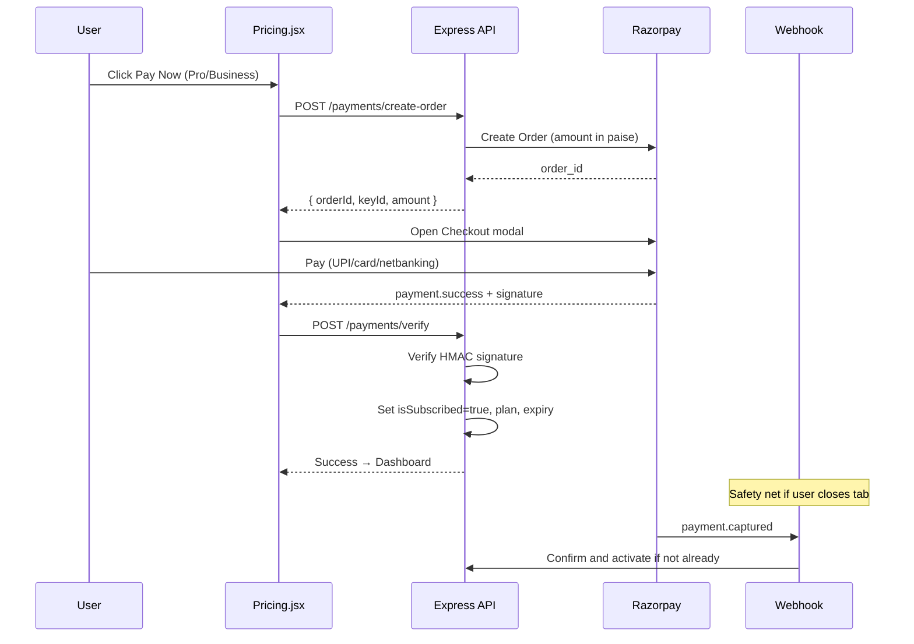

# Expireo — Razorpay Integration Plan

> **Purpose:** Replace the fake “Pay Now → unlock Pro” flow with real Razorpay payments so `isSubscribed` flips only after a successful, verified payment.

> **Status:** Phase 1 ✅ · Phase 2 (recurring + manage billing) ✅ · Phase 3 (history, promos, GST, invoices, retry) ✅

---

## Table of Contents

1. [Current Gap](#1-current-gap)
2. [Recommended Approach](#2-recommended-approach)
3. [Payment Flow](#3-payment-flow)
4. [Pricing Mapping (INR)](#4-pricing-mapping-inr)
5. [Implementation Phases](#5-implementation-phases)
6. [Folder / Code Layout](#6-folder--code-layout)
7. [Security Rules](#7-security-rules)
8. [Pricing CTA Behavior](#8-pricing-cta-behavior)
9. [Build Checklist](#9-build-checklist)
10. [Test Checklist](#10-test-checklist)
11. [Environment Variables](#11-environment-variables)

---

## 1. Current Gap

The Pricing page upgrades Pro without collecting payment:

```js
// frontend/src/pages/Pricing.jsx (current)
const handlePayNow = async (planName) => {
  if (planName === 'Pro') {
    await updateSubscription(true, planName); // no payment
  }
};
```

Backend already gates Pro features via `user.isSubscribed`:

| Feature | Free | Pro / Subscribed |
|---------|------|------------------|
| Links per month | 5 | Unlimited |
| Password protection | ❌ | ✅ |
| Custom expiration | ❌ | ✅ |

**Goal:** Activate `isSubscribed` / `subscriptionPlan` only after Razorpay payment verification.

---

## 2. Recommended Approach

Use **Razorpay Checkout (Orders API)** for Phase 1 (one-time monthly/annual), then add **Subscriptions API** for auto-renewal in Phase 2.

| Plan | Phase 1 | Phase 2 |
|------|---------|---------|
| Free | No payment | — |
| Pro | Order + Checkout | Recurring subscription |
| Business | Order + Checkout | Recurring subscription |
| Enterprise | Contact sales (no Razorpay) | Custom invoices |

**Why Orders first:** Faster to ship, easier to debug, enough for MVP and interviews. Recurring needs more KYC, plan setup, and webhook handling.

---

## 3. Payment Flow



### Step summary

1. User clicks **Pay Now** on Pro/Business.
2. Frontend calls authenticated `POST /payments/create-order` with `{ plan, billingCycle }`.
3. Backend looks up amount from server `planConfig` (never trust client amount).
4. Backend creates Razorpay Order → returns `orderId`, `keyId`, `amount`.
5. Frontend opens Razorpay Checkout modal.
6. On success, frontend sends `payment_id`, `order_id`, `signature` to `POST /payments/verify`.
7. Backend verifies HMAC → updates User → returns success.
8. Webhook `payment.captured` is a backup activation path.

---

## 4. Pricing Mapping (INR)

Razorpay amounts are in **paise** (₹1 = 100 paise).

UI may still show marketing prices; **server config is source of truth**.

| Plan | Monthly | Annual | Order amount (monthly) | Order amount (annual) |
|------|---------|--------|------------------------|------------------------|
| Free | ₹0 | ₹0 | — | — |
| Pro | ₹399 | ₹3990 | `39900` | `399000` |
| Business | ₹999 | ₹9990 | `99900` | `999000` |
| Enterprise | Custom | Custom | No checkout | No checkout |

> Adjust INR amounts to match your final pricing. Current UI shows `$4 / $40` Pro and `$10 / $100` Business — convert deliberately for India launch.

### Example `planConfig.js`

```js
export const PLAN_CONFIG = {
  Pro: {
    monthly: { amount: 39900, currency: 'INR', days: 30 },
    annual:  { amount: 399000, currency: 'INR', days: 365 },
  },
  Business: {
    monthly: { amount: 99900, currency: 'INR', days: 30 },
    annual:  { amount: 999000, currency: 'INR', days: 365 },
  },
};
```

---

## 5. Implementation Phases

### Phase 1 — One-time checkout (3–5 days)

#### 5.1 Razorpay account

- Create Razorpay account
- Get **Key ID** + **Key Secret** (test mode first)
- Enable UPI / cards in dashboard
- Configure webhook URL (staging/production)

#### 5.2 User schema additions

Extend `User` model:

```js
razorpayCustomerId: String,
razorpayPaymentId: String,
razorpayOrderId: String,
subscriptionStatus: {
  type: String,
  enum: ['free', 'active', 'expired', 'cancelled'],
  default: 'free'
},
subscriptionExpiresAt: Date,
```

Existing fields to keep:

- `isSubscribed: Boolean`
- `subscriptionPlan: 'Free' | 'Pro' | 'Business' | 'Enterprise'`

#### 5.3 Payment model (audit trail)

```js
{
  userId: ObjectId,
  plan: 'Pro' | 'Business',
  billingCycle: 'monthly' | 'annual',
  amount: Number,          // paise
  currency: 'INR',
  razorpayOrderId: String,
  razorpayPaymentId: String,
  status: 'created' | 'paid' | 'failed',
  createdAt: Date
}
```

#### 5.4 Backend routes

| Method | Route | Auth | Purpose |
|--------|-------|------|---------|
| `POST` | `/payments/create-order` | JWT | Create Razorpay order for Pro/Business |
| `POST` | `/payments/verify` | JWT | Verify signature; activate subscription |
| `POST` | `/payments/webhook` | Webhook secret | Handle `payment.captured` |
| `GET` | `/payments/history` | JWT | User payment history |

#### 5.5 Frontend Pricing changes

- Load script: `https://checkout.razorpay.com/v1/checkout.js`
- On Pay Now → `create-order` → open Checkout
- On success → `verify` → toast → navigate `/dashboard`
- **Remove** direct `updateSubscription(true)` from public Pricing CTA
- Lock or remove public `PUT /auth/subscription` so users cannot self-upgrade without payment (admin-only if needed)

#### 5.6 Expiry enforcement

- Daily job (cron or BullMQ):
  - If `subscriptionExpiresAt < now` → set `isSubscribed = false`, `subscriptionPlan = 'Free'`, `subscriptionStatus = 'expired'`
- On verify:
  - Monthly → `+30` days
  - Annual → `+365` days

---

### Phase 2 — Recurring subscriptions (1–2 weeks)

- Create Razorpay **Plans** + **Subscriptions**
- Handle webhooks:
  - `subscription.activated`
  - `subscription.charged`
  - `subscription.cancelled`
  - `payment.failed`
- Profile “Manage billing” (cancel / change plan)
- Email receipts (Razorpay or SMTP)

---

### Phase 3 — Polish

- Invoice PDF / payment history UI
- Failed payment retry UX
- Promo / offer codes
- GST invoice fields (if required for India)

---

## 6. Folder / Code Layout

```
backend/src/
  modules/payments/
    payment.routes.js
    payment.controller.js
    payment.service.js      # Razorpay SDK wrappers
    payment.webhook.js
    planConfig.js           # amounts, durations
  models/
    Payment.js
    User.js                 # extended fields

frontend/src/
  pages/Pricing.jsx         # Checkout trigger
  utils/razorpay.js         # loadScript + openCheckout()
```

### Dependencies

```bash
# backend
npm install razorpay
```

Frontend: load Checkout via script tag (no npm package required for basic Checkout).

---

## 7. Security Rules (Must-Have)

1. **Never** activate Pro from frontend alone.
2. **Never** trust `amount` / `plan` from client — always use server `planConfig`.
3. Verify payment signature:
   ```
   HMAC_SHA256(order_id + "|" + payment_id, RAZORPAY_KEY_SECRET)
   ```
4. Verify webhook signature with `RAZORPAY_WEBHOOK_SECRET`.
5. **Idempotent activate:** same `payment_id` must not double-extend subscription.
6. Protect or disable `PUT /auth/subscription` for normal users.
7. Keep `RAZORPAY_KEY_SECRET` and webhook secret server-side only.
8. Frontend may expose only `VITE_RAZORPAY_KEY_ID` (public key).

---

## 8. Pricing CTA Behavior

| Plan | Button action |
|------|----------------|
| Free | Go to signup / dashboard |
| Pro | Razorpay Checkout (monthly/annual) |
| Business | Razorpay Checkout (monthly/annual) |
| Enterprise | Mailto / contact form (no Checkout) |

---

## 9. Build Checklist

- [x] Create Razorpay test account and keys
- [x] Add env vars (see below)
- [x] `npm install razorpay` in backend
- [x] Add `planConfig.js` with INR amounts
- [x] Extend `User` + create `Payment` model
- [x] Implement `POST /payments/create-order`
- [x] Implement `POST /payments/verify`
- [x] Implement `POST /payments/webhook`
- [x] Wire Pricing “Pay Now” to Checkout
- [x] Activate `isSubscribed` + `subscriptionExpiresAt` only after verify
- [x] Lock free self-upgrade on `/auth/subscription`
- [x] Add subscription expiry job
- [x] Phase 2: recurring subscriptions + cancel/change plan
- [x] Phase 3: billing UI, promos, GST, invoices, retry
- [ ] Test success / failure / close modal / duplicate verify
- [ ] Configure `RAZORPAY_WEBHOOK_SECRET` + live webhook URL
- [ ] Switch to live keys for production
- [ ] Optional: configure SMTP for email receipts

---

## 10. Test Checklist

| Scenario | Expected |
|----------|----------|
| Pay with Razorpay test card | Pro/Business unlocks; dashboard shows active plan |
| Close checkout mid-way | User stays Free |
| Tamper amount on frontend | Server ignores; uses `planConfig` |
| Replay same payment verify | No double credit / no double expiry extension |
| After `subscriptionExpiresAt` | Pro features lock again (`isSubscribed = false`) |
| Webhook only (no frontend verify) | Subscription still activates |
| Enterprise CTA | Opens contact / sales — no Checkout |

### Razorpay test cards

Use cards from [Razorpay test cards docs](https://razorpay.com/docs/payments/payments/test-card-details/) in test mode.

---

## 11. Environment Variables

### Backend (`.env`)

```env
RAZORPAY_KEY_ID=rzp_test_xxxxxxxx
RAZORPAY_KEY_SECRET=xxxxxxxxxxxxxxxx
RAZORPAY_WEBHOOK_SECRET=xxxxxxxxxxxxxxxx
```

### Frontend (`.env`)

```env
VITE_RAZORPAY_KEY_ID=rzp_test_xxxxxxxx
```

> Never commit real secrets. Use test keys in local/staging; live keys only in production (Secrets Manager / host env).

---

## Mapping to Current Codebase

| Existing piece | Change |
|----------------|--------|
| `frontend/src/pages/Pricing.jsx` | Replace `updateSubscription(true)` with Checkout flow |
| `frontend/src/context/AuthContext.jsx` | Keep `updateSubscription` for internal/admin use only, or remove from Pricing |
| `backend/src/controllers/authController.js` → `updateSubscription` | Require admin role OR remove public access |
| `backend/src/models/User.js` | Add Razorpay + expiry fields |
| `backend/src/controllers/linkController.js` | Keep `isSubscribed` gates (already correct) |
| `frontend/src/pages/Profile.jsx` | Show expiry date; later add Manage Billing |
| `frontend/src/pages/Dashboard.jsx` | Reflect real subscription status after payment |

---

## Success Criteria

- [ ] Pro/Business cannot be activated without a verified Razorpay payment
- [ ] Free users still limited to 5 links/month and no password/custom expiry
- [ ] Paid users get Pro features until `subscriptionExpiresAt`
- [ ] Payment records exist for audit
- [ ] Webhook + verify paths are idempotent
- [ ] Test mode works end-to-end before going live

---

*Last updated: July 2026 · Project: Expireo (Expirable URL Generator)*
