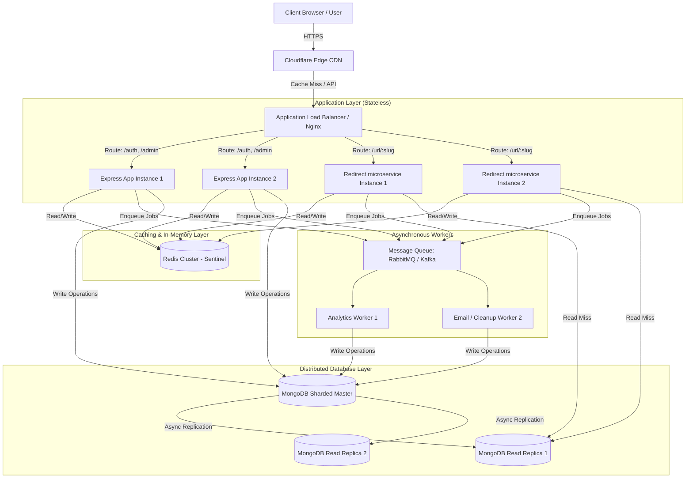

# Expireo – High-Scale System Design & Scalability Plan

This document outlines a production-grade system architecture and migration plan to scale **Expireo** (the Expirable URL Generator SaaS) from its current MERN stack design to a distributed, highly available, and resilient enterprise-grade architecture capable of handling millions of requests per second.

---

## 1. Executive Summary & Current Architecture Bottlenecks

### Current Architecture Assessment
Currently, Expireo is a standard **MERN** stack application:
- **Frontend:** React + Vite deployed to Vercel/similar.
- **Backend:** Express.js API running in a single process via Node, proxying through a single Nginx instance.
- **Database:** MongoDB (Mongoose) storing all states (Users, Links, Analytics, FailedAttempts, IPAnalytics).

### Key Architectural Bottlenecks
1. **Database-Based Rate Limiting:** 
   The current rate-limiting middleware ([advancedRateLimitMiddleware.js](file:///d:/ExpirableURLGenerator/backend/src/middlewares/advancedRateLimitMiddleware.js)) performs multiple database reads/writes (`IPAnalytics.findOne`, `ipAnalytics.save`, `Link.findOne`, `link.save`) **on every incoming redirect request**. Under a DDoS or normal high traffic, the database will fail due to high connection limits and lock contention.
2. **Blocking Redirection Flow:** 
   Analytics objects are created synchronously and blocking during the redirection phase ([linkController.js](file:///d:/ExpirableURLGenerator/backend/src/controllers/linkController.js)). Direct writes to MongoDB on every redirection hop slow down click redirects.
3. **Single Point of Failure (SPOF):** 
   A single server running Express with node-cron in-process will double-run cron tasks if duplicated or crash if memory limits are exceeded.
4. **Lack of Edge Optimization:** 
   Every redirect request must travel back to the origin backend database, leading to high latency for global users.

---

## 2. Global System Architecture



---

## 3. High-Performance Caching Strategy (Redis)

To offload database reads during the critical path (resolving the shortened URL and redirecting), Redis is introduced as a fast, in-memory caching layer.

### Implementation Checklist
1. **Cache-Aside Pattern for Link Resolution:**
   - When a user requests a short link (`GET /url/:slug`):
     1. Search Redis for the slug key: `link:slug:<slug_id>`.
     2. **Cache Hit:** Parse JSON, validate password/expiry, and perform redirect.
     3. **Cache Miss:** Query MongoDB, store results in Redis with a Time-To-Live (TTL), and proceed.
   
2. **Cache Invalidation:**
   - When a link is updated, manually expired, or locked due to abuse:
     - Issue `DEL link:slug:<slug_id>` in Redis to ensure consistency.
   - For links with an explicit expiry, set the Redis TTL equal to the link's remaining lifetime:
     $$\text{TTL} = \text{Expiry Time} - \text{Current Time}$$

### Cache Key Structure
| Key Name | Data Type | Purpose | TTL |
| :--- | :--- | :--- | :--- |
| `link:slug:<slug>` | Hash / JSON | Stores `targetUrl`, `passwordHash`, `expiry`, `status` | 24 Hours or Expiry Time |
| `link:stats:<ownerId>` | String / JSON | Cached user dashboard aggregate stats | 15 Minutes |
| `user:profile:<userId>` | String / JSON | Cached subscription details (Free vs Pro) | 1 Hour |

```javascript
// Example implementation of cached link resolution
export const getCachedLink = async (slug) => {
  const cacheKey = `link:slug:${slug}`;
  
  // 1. Try fetching from Redis
  const cachedData = await redisClient.get(cacheKey);
  if (cachedData) {
    return JSON.parse(cachedData);
  }

  // 2. Fetch from MongoDB on miss
  const link = await Link.findOne({ slug }).lean();
  if (!link) return null;

  // 3. Write to Redis with appropriate TTL (e.g., 1 day or remaining expiry time)
  let ttl = 86400; // 24 hours
  if (link.expiry) {
    const remainingTime = Math.floor((new Date(link.expiry) - new Date()) / 1000);
    if (remainingTime <= 0) return null; // Already expired
    ttl = Math.min(ttl, remainingTime);
  }

  await redisClient.setEx(cacheKey, ttl, JSON.stringify(link));
  return link;
};
```

---

## 4. Distributed Rate Limiting (Redis)

Moving rate limiting from MongoDB to Redis using a **Sliding Window Log** or **Token Bucket** algorithm ensures sub-millisecond rate checks without database load.

### Redis Sliding Window Algorithm (using Sorted Sets - ZSET)
1. For every client request, use the client's IP or API Key as the key: `rate:ip:<IP_ADDRESS>`.
2. Clear elements in the ZSET older than the tracking window: `ZREMRANGEBYSCORE key 0 (currentTime - windowSize)`.
3. Retrieve current request count: `ZCARD key`.
4. If request count exceeds limit, reject with HTTP 429.
5. Else, add current timestamp to ZSET: `ZADD key currentTime currentTime`.
6. Set key expiration to `windowSize` to auto-clean idle IPs.

### Node.js Redis Rate Limiting Middleware
```javascript
import redisClient from "../config/redis.js";

export const distributedRateLimiter = (maxRequests, windowSeconds) => {
  return async (req, res, next) => {
    const ip = req.ip;
    const key = `rate:ip:${ip}`;
    const now = Date.now();
    const windowStart = now - (windowSeconds * 1000);

    try {
      const multi = redisClient.multi();
      
      // Remove requests older than the sliding window
      multi.zRemRangeByScore(key, 0, windowStart);
      // Retrieve the number of requests in the current window
      multi.zCard(key);
      // Add the current request timestamp
      multi.zAdd(key, { score: now, value: now.toString() });
      // Reset TTL for the tracking key
      multi.expire(key, windowSeconds);

      const results = await multi.exec();
      const requestCount = results[1]; // Value from zCard

      if (requestCount >= maxRequests) {
        return res.status(429).json({
          message: "Too many requests. Please try again later.",
          retryAfter: windowSeconds
        });
      }
      next();
    } catch (err) {
      console.error("Rate limiter error", err);
      next(); // Fail-open or fallback to local memory in production
    }
  };
};
```

---

## 5. Horizontal Scaling & Load Balancing

To scale the Application Layer, we make Express instances completely stateless and deploy multiple instances behind a load balancer.

### Application Layer Stateless Checklist
*   **Move Sessions to JWT:** Completed (currently verified in `authMiddleware.js`). No session state is held on local disk/memory.
*   **Centralize File Uploads:** Move from local directories to Object Storage (AWS S3, Google Cloud Storage, Cloudinary) with expirable signed URLs.
*   **Offload Background Crons:** Extract the `node-cron` daemon from the web servers. Set up a dedicated background worker task queue (e.g., using BullMQ and Redis) so only one scheduler fires cleanup tasks.

### Load Balancer Layer (Nginx Config)
Set Nginx up to perform round-robin load balancing with health checks and IP hashing for administrative sessions.

```nginx
# nginx.conf configuration for upstream load balancing
upstream expireo_backend {
    ip_hash; # Sticky sessions based on IP (optional, useful for admin sockets)
    server backend1.expireo.internal:5001 max_fails=3 fail_timeout=15s;
    server backend2.expireo.internal:5001 max_fails=3 fail_timeout=15s;
    keepalive 32; # Keep-alive connections to upstream to minimize TCP handshakes
}

server {
    listen 80;
    server_name expireo.nexoral.in;
    return 301 https://$host$request_uri; # Force SSL redirect
}

server {
    listen 443 ssl http2;
    server_name expireo.nexoral.in;

    ssl_certificate /etc/letsencrypt/live/expireo.nexoral.in/fullchain.pem;
    ssl_certificate_key /etc/letsencrypt/live/expireo.nexoral.in/privkey.pem;
    ssl_protocols TLSv1.2 TLSv1.3;

    # Gzip Compression for fast responses
    gzip on;
    gzip_types text/plain text/css application/json application/javascript text/xml;

    # Health Check API
    location /health {
        proxy_pass http://expireo_backend/health;
        access_log off;
    }

    location / {
        proxy_pass http://expireo_backend;
        proxy_http_version 1.1;
        proxy_set_header Connection "";
        proxy_set_header Host $host;
        proxy_set_header X-Real-IP $remote_addr;
        proxy_set_header X-Forwarded-For $proxy_add_x_forwarded_for;
        proxy_set_header X-Forwarded-Proto $scheme;
    }
}
```

---

## 6. CDN (Content Delivery Network) Integration

A CDN acts as the outermost proxy layer closest to the end-users, lowering latency and shielding servers from brute DDoS attacks.

```
[User Request] 
      │
      ▼
┌──────────────┐      Edge Cache Hit?
│ Cloudflare   ├───────────────────────────────┐
│ Edge Node    │                               │
└──────┬───────┘                               │
       │ Cache Miss                            ▼ [301/302 Redirect Served]
       ▼                                (Sub-millisecond latency)
┌──────────────┐
│  Origin LB   │
└──────────────┘
```

### Implementing CDN Routing
1. **Frontend Static Assets:**
   - Configure Cloudflare or CloudFront to cache Vite build outputs (`/assets/*`, images, JS, CSS) at edge nodes with long-term caching (`Cache-Control: public, max-age=31536000`).
2. **Short URL Dynamic Redirections:**
   - Bypass caching for endpoints where analytics collection is critical, **OR**
   - **Edge Short URL Resolution:** Use **Cloudflare Workers** + **Cloudflare KV Store** (or Redis Enterprise Edge). Resolve the slug on the Edge worker:
     - Worker checks KV database for the slug.
     - Worker issues a direct 301/302 redirect response to the client.
     - Worker sends an asynchronous click log payload via Cloudflare Queue to the analytics queue backend.
     - **Result:** Latency drops from ~200ms to <15ms globally.

---

## 7. Message Queue for Asynchronous Operations

Analytics generation (`Analytics.create()`) is currently blocking the critical path. Introducing a message queue (RabbitMQ / Kafka) decouples API redirects from database storage.

```
[Redirect request] ──► [Express App] ──► [Write to Queue] ──► [Instant Redirect to Target]
                                               │
                                               ▼
                                        [Message Queue]
                                               │
                                               ▼
                                      [Analytics Worker]
                                               │
                                               ▼ (Batch Write)
                                        [MongoDB Primary]
```

### Decoupling Analytics Pipeline
1. **Express Producer:**
   - When redirecting: Generate analytics metadata payload and push it to the queue:
     ```javascript
     const logPayload = {
       linkId: link._id,
       ip: req.ip,
       userAgent: req.get("User-Agent"),
       referrer: req.get("Referrer"),
       timestamp: new Date()
     };
     // Push to RabbitMQ / Kafka / BullMQ
     await messageQueue.publish("analytics-logs", logPayload);
     ```
2. **Worker Consumer:**
   - A dedicated worker node processes messages in batches:
     - Reads batches of 100 messages.
     - Executes a single bulk insertion into MongoDB: `Analytics.insertMany(batch)`.
     - Increments the `clicks` counters in bulk.
     - This drastically reduces database operations by 100x.

---

## 8. Database Replication & Read-Write Splitting

To ensure high availability and scale read throughput, MongoDB should be deployed as a Replica Set with primary-secondary replication.

```
                ┌───────────────┐
                │ Write Request │
                └───────┬───────┘
                        │
                        ▼
                ┌───────────────┐
                │  Primary node │
                └─┬───────────┬─┘
                  │           │
   Async Replicate│           │Async Replicate
                  ▼           ▼
         ┌───────────┐     ┌───────────┐
         │Secondary 1│     │Secondary 2│
         └─────┬─────┘     └─────┬─────┘
               │                 │
               └────────┬────────┘
                        │
                        ▼
                 ┌──────────────┐
                 │ Read Request │
                 └──────────────┘
```

### Configuration Rules
1. **Replica Set Architecture:**
   - Deploy at least **3 nodes**: 1 Primary (accepts all writes) and 2 Secondaries (asynchronously replicate oplog).
2. **Read-Write Splitting in Mongoose:**
   - Route writes (e.g., link creation, updates) to the Primary.
   - Route reads (e.g., fetching user dashboard links, resolving slugs on cache miss) to secondaries.
   - Implement in MongoDB connection URI:
     ```javascript
     mongoose.connect("mongodb://db1.example.com,db2.example.com,db3.example.com/expireo?replicaSet=rs0&readPreference=secondaryPreferred");
     ```

---

## 9. Database Sharding

When the database grows beyond vertical hardware limits (millions of users and billions of links/analytics records), we scale horizontally by distributing the collections across multiple physical database partitions (shards).

### Sharding Architecture for Expireo

```
                  ┌───────────────┐
                  │ Client / App  │
                  └───────┬───────┘
                          │
                          ▼
                  ┌───────────────┐
                  │ Mongos Router │
                  └─┬───────────┬─┘
                    │           │
     Routing Table  │           │
  (From Config Srv) │           │
                    ▼           ▼
              ┌───────────┐┌───────────┐
              │  Shard A  ││  Shard B  │
              │ (slug-A-M)││ (slug-N-Z)│
              └───────────┘└───────────┘
```

### Choosing Shard Keys
Selecting the correct shard key is critical to avoid hot shards (uneven distribution) and scatter-gather queries (queries querying all shards instead of targeted ones).

| Collection | Proposed Shard Key | Type | Rationale |
| :--- | :--- | :--- | :--- |
| **`links`** | `{ slug: "hashed" }` | Hashed | Ensures even distribution of short links across shards. Prevents hot-spotting when links are created at high frequency. |
| **`analytics`** | `{ linkId: 1, timestamp: 1 }` | Compound | Co-locates all analytics records for a specific link on the same shard. Makes aggregating data for dashboard charts highly efficient without cross-shard queries. |
| **`users`** | `{ _id: "hashed" }` | Hashed | Evenly distributes user login and profile data. |

---

## 10. Consistent Hashing in Distributed Architectures

Consistent Hashing is a technique used to partition keys across servers (specifically cached data or sharded storage nodes) such that when servers are added or removed, the number of keys shuffled is minimized.

### Application in Expireo
1. **Routing in Distributed Redis Cluster:**
   - Redis cluster maps keys to **16,384 logical hash slots**.
   - The slug string is hashed using CRC16 to determine its slot:
     $$\text{slot} = \text{CRC16}(\text{slug}) \pmod{16384}$$
   - This implements consistent hashing at the caching tier. If a Redis node fails, its replicas take over automatically with minimal cache eviction.
2. **Deterministic Custom Load Balancing:**
   - Consistent hashing can route redirect requests to specialized API endpoints based on their `slug`. Requests for the same short URL hit the same API server, allowing optimized local caching and lock retention.

---

## 11. Distributed Systems Security & Consensus

When scaling to a distributed multi-node system, we must handle split-brain scenarios, race conditions, and synchronization.

### 1. Distributed Locking (Redlock)
- **Problem:** Two workers concurrently attempting to clean up the same expired link or two requests executing brute-force validation on the same link concurrently.
- **Solution:** Implement **Redlock** using Redis to acquire distributed locks:
  ```javascript
  import Redlock from "redlock";
  
  const redlock = new Redlock([redisClient]);

  const lock = await redlock.acquire([`lock:link:${slug}`], 5000); // 5 sec lock
  try {
    // Perform safety-critical database update (e.g. lockout verification)
  } finally {
    await lock.release();
  }
  ```

### 2. High-Precision Distributed ID Generation
- Avoid standard auto-incrementing IDs or basic UUIDs (which take too much indexing space).
- Continue using `nanoid` (cryptographically strong, url-friendly, compact, distributed-safe) or implement **Twitter Snowflake IDs** for timestamp-ordered database indexes.

### 3. Distributed Event Logging
- Aggregate logs using a centralized system (Elasticsearch, Logstash, Kibana (ELK) or Datadog) rather than keeping them locally on node volumes.
- Send logs via UDP/Winston Transport to prevent log writing from blocking API responsiveness.

---

## Summary of Actionable Implementation Roadmap

```
Phase 1: In-Memory Caching & Distributed Rate Limiting (Redis)
   │  - Extract Rate Limiting middleware from Mongo to Redis (sliding window log).
   │  - Implement Redis caching for link resolution (`slug -> Link Metadata`).
   ▼
Phase 2: Decouple Redirection & Analytics Write Pipeline (RabbitMQ / BullMQ)
   │  - Set up background workers.
   │  - Make analytics log insertion asynchronous via a message queue.
   ▼
Phase 3: High Availability (Database Replication & Read Preferences)
   │  - Upgrade MongoDB to Replica Set. Configure Mongoose to read from Secondaries.
   │  - Deploy stateless backend instances behind HAProxy / AWS ALB.
   ▼
Phase 4: Global Performance Optimization (CDN & Sharding)
   │  - Configure CDN for asset caching and DDoS filtering at the edge.
   │  - Implement MongoDB hashed Sharding keys to distribute write scale.
```
